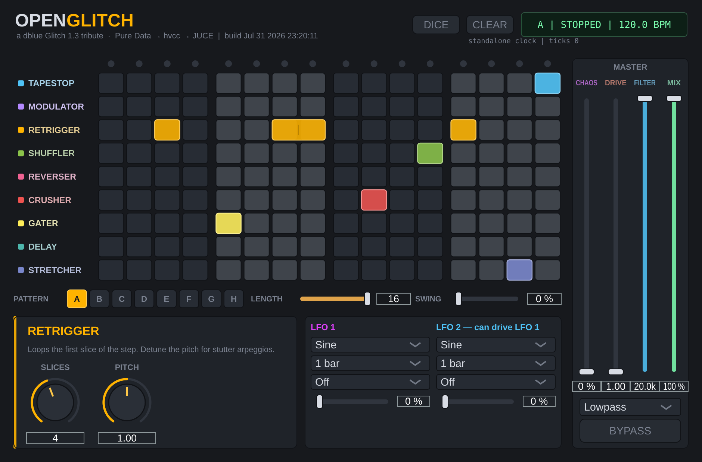

# OpenGlitch



An open-source recreation of **dblue Glitch 1.3** (original concept by Kieran Foster),
built from:

- **Pure Data** patches compiled to C/C++ by **[hvcc](https://github.com/Wasted-Audio/hvcc)** (Wasted-Audio fork)
- **[JUCE 8](https://github.com/juce-framework/JUCE)** for the plugin wrapper and GUI
- **CMake** for the build

Licensed under **GPLv3** (see [LICENSE](LICENSE)).

## Status

Feature complete for 1.0:

- **8 pattern slots (A–H)** — the strip below the matrix switches patterns;
  edits always record into the active slot; shift-click a slot to copy the
  current pattern there. The selector is a DAW-automatable parameter, and
  **MIDI notes C1–G1 (36–43) switch patterns live**, Glitch-style.
- **Per-pattern length** (1–16 steps) for odd meters and polymeter loops.
- **Swing** (0–100%) — sample-accurately scheduled in hosted mode, delayed
  odd-step firing in the standalone clock.
- **Mono tracks supported** (mono in is duplicated, mono out averaged).
- **Effect spans (Tie)** — drag across a row to stretch one effect over
  multiple steps, like the original's wide blocks. Tied steps don't
  re-trigger: a tape stop winds down across the whole span, a retrigger
  keeps looping its first slice, a reverser reverses the full length.
  Step parameters gained an 11th choice ("Tie") for this.
- **One clock** — JUCE drives the sequencer everywhere now; without a host
  timeline a virtual one free-runs, so swing, chaos and spans behave
  identically in DAWs and standalone.
- **DICE** — one click fills the active pattern with a random (musically
  weighted) grid, occasionally tying steps into spans; CLEAR empties it.
- **Multimode master filter** — Lowpass / Highpass / Bandpass selector under
  the master faders (bandpass is a hip~/lop~ series pair).
- **Tempo-synced ring modulator** — a SYNC selector on the Modulator panel
  locks its frequency to divisions from 1/16 to a full bar.
- **Two tempo-synced LFOs** (sine/tri/saw/square/S&H random, 1/16 to 4 bars,
  ppq-locked to the DAW bar). Targets: filter freq, drive, chaos, mod freq,
  retrigger pitch, gate duty — and LFO 2 can instead drive **LFO 1's rate or
  depth** for cascaded, derivative modulation.

Phase 4 — full custom GUI. The editor recreates the Glitch matrix: 9 effect
rows x 16 step columns. Click a cell to assign the effect, click again to
clear, drag to paint, right-click to erase a column. The playhead lamp and
column wash follow the DAW-locked sequencer, an LCD shows step and tempo,
the bottom panel swaps to the knobs of the last-touched effect, and the
right-hand strip carries Chaos / Drive / Filter / Mix plus Bypass. Everything
binds through APVTS attachments; a headless screenshot tool
(`-DOPENGLITCH_BUILD_TOOLS=ON`, target `OpenGlitchScreenshot`) renders the
editor to PNG without a display for docs and CI.

Phase 2 — the DSP engine is complete in Pure Data. A 16-step sequencer
(`glitch_clock`) runs at one 16th note per step from `host_bpm`/`host_playing`
(free-running at 120 BPM until Phase 3 wires up DAW transport) and broadcasts
the current step's effect to nine parallel effect patches, gated in with 5 ms
crossfades. A `seq_chaos` control randomly overrides the programmed grid, and a
master section adds overdrive, lowpass and wet/dry mix. The default grid ships
with a demo pattern so the plugin glitches audibly on first load.

Effect indices for the `step_1..16` parameters:

| # | Effect | Character | Controls |
|---|--------|-----------|----------|
| 0 | Dry | untouched input | — |
| 1 | TapeStop | slows to a stop across the step | `fx_tapestop_speed` |
| 2 | Modulator | ring mod, tremolo → metallic | `fx_mod_freq` |
| 3 | Retrigger | loops the step's first slice | `fx_retrigger_rate`, `fx_retrigger_pitch` |
| 4 | Shuffler | swaps in a random earlier step | `fx_shuffle_range` |
| 5 | Reverser | plays recent audio backwards | — |
| 6 | Crusher | sample-rate crush + drive | `fx_crush_rate`, `fx_crush_drive` |
| 7 | Gater | rhythmic chopper | `fx_gate_rate`, `fx_gate_duty` |
| 8 | Delay | tempo-synced damped echo | `fx_delay_div`, `fx_delay_feedback` |
| 9 | Stretcher | tape-style half-speed drag | `fx_stretch_speed` |

Master: `master_drive`, `master_lowpass`, `master_mix`, `bypass`, `seq_chaos`.
The sequencer emits a `playhead` output parameter for the Phase 4 GUI.

As of Phase 3, all 34 parameters are exposed to the DAW through a JUCE
`AudioProcessorValueTreeState` (grouped Sequencer / Effects / Master, step
slots as named choices, proper units and log skews, `bypass` reported as the
host bypass parameter), and plugin state saves/restores with the session.

**Transport sync:** when a DAW timeline is present, JUCE *is* the clock — the
Pd metro is switched off and every 16th note is derived from `ppqPosition`
and scheduled sample-accurately into the Heavy context (`host_tick`), so the
grid locks to the DAW bar and follows loops, relocates and tempo changes.
Step 1 is always the start of a bar. On transport stop the engine falls back
to clean dry. Without a timeline (standalone) the Phase 2 free-running
120 BPM metro takes over.

## Tests

A Catch2/CTest suite covers three layers: the Heavy DSP engine driven
directly (sequencer, effects, external clock, swing/length timing, filter
modes), the pure LFO/modulation math, and full host simulation (a fake
`AudioPlayHead` feeding transport/tempo/ppq to the real processor — the layer
neither pluginval nor DSP tests can see). Each test case runs as an isolated
process with a timeout, so hangs fail instead of blocking.

```sh
cmake -B build -DCMAKE_BUILD_TYPE=Release -DOPENGLITCH_BUILD_TESTS=ON
cmake --build build --target OpenGlitchTests -j
ctest --test-dir build -j$(nproc)
```

## Building

Requirements: CMake ≥ 3.22, a C++17 compiler, Python ≥ 3.9, and (on Linux) the
usual JUCE dev packages (ALSA, X11, freetype, fontconfig).

```sh
cmake -B build -DCMAKE_BUILD_TYPE=Release
cmake --build build -j
```

The first configure fetches JUCE and hvcc and installs hvcc into a virtualenv
inside `build/`. The Pd patch `pd/main.pd` is recompiled by hvcc automatically
whenever it changes.

Artifacts land in `build/OpenGlitch_artefacts/Release/`:

- `VST3/OpenGlitch.vst3`
- `Standalone/OpenGlitch`

## Layout

- `pd/main.pd` — the DSP, as a Pure Data patch (edit with plain Pd-vanilla)
- `src/` — JUCE C++ wrapper (processor, later the step-sequencer GUI)
- `CMakeLists.txt` — fetches JUCE + hvcc, runs hvcc, builds the plugin
